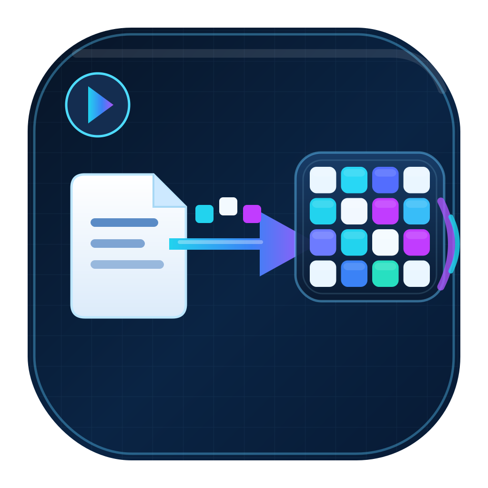
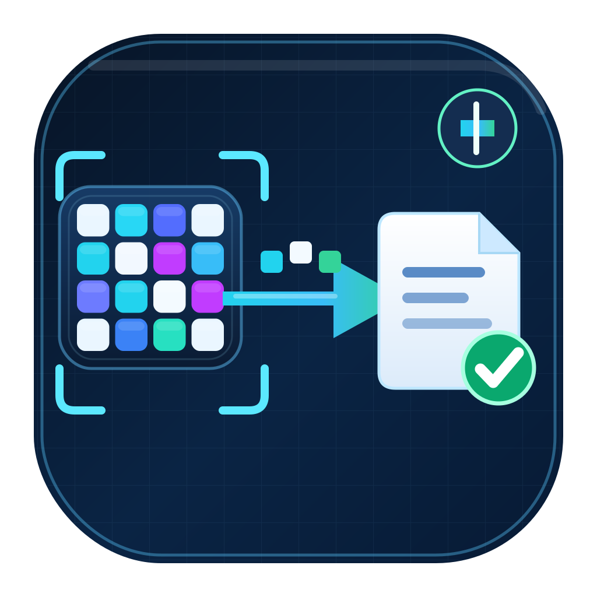

# PixelBridge

[简体中文](README.md) | **English**

<p>
  
  
</p>

### Another way to bring a file back when you can see the remote desktop

PixelBridge is a Windows file-transfer tool. It encodes a file into a changing visual pattern and reconstructs it on another computer from the **actual screen pixels** displayed by a remote-desktop connection.

No shared directory, clipboard transfer, drive mapping, or remote-control file-transfer feature is required. The sender displays pixels; the receiver captures, reconstructs, and verifies the file.

> **PixelBridge v1.0** provides two separate applications, Encoder and Decoder, with Standard, Gray Fast, PAM4, and PAM4 Wide transfer modes, resumable reception, integrity verification, and diagnostic logs on both ends.

> **Segmented streaming for large files.** The entire file does not need to fit in memory at once, allowing the design to scale to larger files. **The current v1.0 per-file limit is 500 GiB**, subject to available disk space and receiver resource budgets. This is a product admission limit, not a claim of a completed 500 GiB field test.

> **Under specific conditions, average reception speed can reach approximately 279 KB/s.** This is a retained result from a complete large-file transfer using PAM4 Wide over an actual non-local remote connection, including final file verification—not an instantaneous peak. See [transfer speed](#what-transfer-speed-should-i-expect) below for the environment and measurement convention.

## Inspiration and improvements

This project was inspired by [libcimbar](https://github.com/sz3/libcimbar), which demonstrates file transfer through animated colored patterns on a screen read by a smartphone camera. PixelBridge focuses that visual-transfer idea on **Windows non-local remote-desktop workflows**, with improvements tailored to this use case:

- **Direct remote-desktop reception:** capture the actual screen pixels displayed by the remote window, without a phone or camera, to bring a file from the remote computer to the local one.
- **Picture encoding designed for video compression:** Gray Fast, PAM4, and PAM4 Wide reduce reliance on a color data channel, with optimization judged by the reception speed of a correctly reconstructed final file.
- **An integrated large-file workflow:** segmented streaming, bounded memory budgets, resumable recovery, whole-file verification, graphical applications on both ends, and diagnostic logs support long transfers and troubleshooting.

These advantages target remote-desktop and large-file reception needs. The projects have different typical use cases; speed figures from different environments are not treated as a direct performance comparison.

## When is it useful?

- You can view a remote desktop, but do not have a convenient file-transfer channel.
- Your remote-desktop or virtual-desktop (VDI) workflow needs a way to bring a file back through the existing visible desktop.
- You need resumable reception and a verified final file, with diagnostics for larger transfers.
- Your receiving computer has one monitor: start reception, then make the remote data pattern visible over the selected screen. No reserved area for the Decoder window is required.

PixelBridge is not a remote-control application. It neither establishes the remote connection nor changes remote-control or network settings. It does not use a camera. If direct file copying is available, ordinary file transfer is usually faster and easier.

## Two applications, two roles

| Application | Computer | Responsibility |
| --- | --- | --- |
| **PixelBridgeEncoder** | Remote computer containing the file | Select the file and display a repeating visual stream |
| **PixelBridgeDecoder** | Computer that needs the file | Capture a selected screen/region and save the reconstructed file |

There is no return channel for progress or acknowledgments. **Wait for Decoder to report completion, then stop Encoder manually.** Time spent sending or the number of passes is not proof of successful reception.

## Quick start

1. Start the appropriate application on each computer and choose **the same mode** on both ends.
2. In Decoder, select an output directory, monitor, and whole-screen or region capture.
3. **Start Decoder receiving first.**
4. Select the source file in the remote Encoder and start sending. Keep the complete pattern visible; avoid panels, overlapping windows, and pointer obstruction.
5. Wait for Decoder to report completion, then stop Encoder.

**The received-size display may temporarily stop increasing during a large transfer.** When the UI reports segment repair, verification, writing, or carousel waiting, this is an expected wait: **keep receiving; do not pause**. An explicit capture interruption, lack-of-progress warning, or error must instead be investigated, not dismissed as normal.

See the [user guide](docs/USER_GUIDE.en.md) for operation, resume, and precautions.

## Resolution and mode selection

**For non-local transfer with a 1080P display, try PAM4 first, select it on both ends, and start with a sending rate of 25 Hz.** Standard remains the initial default, so select PAM4 explicitly when following this recommendation.

### How do Standard, Gray Fast, and PAM4 differ?

They are three different ways to encode data into a picture, not three picture-quality settings for the same mode:

| Mode | How the picture carries data | When to use it and the trade-off |
| --- | --- | --- |
| **Standard** | Small patterns carry data through **shape and color** | The original default, retained for compatibility. Keep it when an existing setup works reliably; remote-video compression can damage the color channel, so it is not the first recommendation for 1080P remote transfer. |
| **Gray Fast** | Grayscale patterns carry data through **shape and brightness**, without a color data channel | Offers a higher per-frame payload, but still depends on fine pattern detail surviving the video path. Use an already reliable setup, or compare it as an alternative when PAM4 performs poorly. |
| **PAM4** | Regular blocks use four brightness levels: **black, dark gray, light gray, and white** | **The first recommendation for non-local 1080P transfer.** Uniform grayscale data cells reduce reliance on fine pattern and color detail, aiming to deliver more usable data after remote-video compression. |

**The name “Gray Fast” does not mean it is faster than PAM4 on every remote connection.** Packing more data into a frame can increase total reception time if more of that data is lost during video compression. This recommendation follows the current implementation and retained tests; it is not a universal speed ranking. If PAM4 performs poorly, compare Gray Fast manually using the same small file and environment, judging by verified whole-file completion time. All three modes retain final file-integrity verification rather than trading it away for speed.

### PAM4 Wide and resolution

**PAM4 Wide is a larger-raster version of PAM4, not a higher setting intended for 1080P.** It uses the same four-level grayscale principle and a larger display area to carry more data:

| Mode | Fixed sender raster | Suitable sender desktop |
| --- | --- | --- |
| PAM4 | 1920×1080 | 1080P, or centered on a larger desktop |
| PAM4 Wide | 2560×1440 | A desktop that fits the complete raster, such as 1440P / 1600P |

These are the **physical desktop dimensions of the computer containing the file**, not the Decoder window size. **For a 1080P sender, choose PAM4, not Wide; do not shrink Wide to fit 1080P.** Standard and Gray Fast also use a 1920×1080 base raster. Decoder supports whole-screen or region capture, but remote scaling, quality, and delivered pixels affect reception; display resolution alone cannot guarantee speed. A rate of 25 Hz is a starting point, not a universal optimum, and sending faster is not necessarily better.

The current PAM4-family GUI also requires an unrotated sender display no larger than 3840×2160. Supported dimensions have explicit lower and upper bounds; arbitrary resolutions are not implied.

Single-monitor reception is implemented. An independent computer with only one physical monitor has not been available for qualification; testing one selected monitor on a dual-monitor computer is not that qualification. See [support and validation scope](docs/PROJECT_STATUS.en.md).

## Can a computer with more RAM help?

Decoder's advanced options offer **memory-budget-based reception** for Gray Fast, PAM4, and PAM4 Wide. Set the total active-decoder budget and per-instance limit, or request a recommendation based on currently available memory.

This can reduce admission delays caused by occupied decoder slots. Filling all RAM is not the goal: the OS, remote application, capture buffers, and resume data need headroom. Paging can make reception slower. See [memory budgets](docs/DECODER_MEMORY_BUDGET.en.md).

## What transfer speed should I expect?

Speed depends on the **entire remote-video path**, not one universal throughput figure.

Retained non-local tests achieved the following **average verified whole-file reception speeds**:

| Mode and sender resolution | Average reception speed | Test scope |
| --- | ---: | --- |
| **PAM4 Wide · 2560×1600** | **About 279 KB/s** | Complete large file, approximately 1.12 GiB |
| **PAM4 · 1920×1080** | **About 190 KB/s** | A 91 MiB small file; not a large-file speed guarantee |

Both records used ToDesk Professional at HD quality and a 25 Hz sending rate, with a 2560×1440 local receiving display. **KB/s follows the Decoder UI convention: 1 KB = 1024 bytes.** Each average divides the original file size by the full receiver runtime, including startup waiting, repair, disk writes, whole-file verification, and final reopen verification. It is neither a peak rate nor theoretical bandwidth.

These are retained measurements from specific test environments, not fresh speed tests of this release build or a comparison using the same resolution and file for both modes. **The approximately 279 KB/s Wide result is not a speed promise for 1080P PAM4.** Neither these speeds nor continuously increasing progress are guaranteed on arbitrary remote connections. See [evidence and limitations](docs/EVIDENCE_INDEX.md#readme-speed-reference) for versions, original values, and verification details.

## Troubleshooting

Normal GUI and transfer CLI runs automatically write low-frequency diagnostic logs. Use **Open log directory** in the advanced tab, or export a report manually.

- Default location: `%LOCALAPPDATA%\PixelBridge\Logs\Encoder` or `Decoder`.
- Logs describe sending, capture, decoding, resource waits, and final verification. They do not store screenshots or file contents.
- Final reports can contain filenames, local paths, session identifiers, and environment information. Review them before sharing.

See [diagnostics](docs/DIAGNOSTICS.en.md).

---

## How it works

```text
Remote file → Segmentation/compression → Erasure/error coding → Visible pattern
                                                                   ↓ Remote video
Local file  ← Integrity verification ← Segment recovery ← Captured screen pixels
```

- **Visual-only and one-way:** recovered content comes only from captured pixels, without a hidden file channel or reverse ACK.
- **Tolerates missing pictures:** carousel scheduling and fountain repair let the receiver continue collecting useful data after frame loss.
- **Segmented, bounded, resumable:** memory need not scale with the full file; verified segments are written to disk and recovery state is validated on resume.
- **Correctness first:** transport CRC, segment digests, and whole-file BLAKE3 are separate checks. Completion requires verified publication and final reopen verification.

### Main engineering challenges

1. **Remote desktops transport video, not original pixels.** Chroma subsampling, lossy coding, scaling, duplicate frames, and partial updates distort a data pattern. The newer route uses separately identified four-level grayscale PAM4 with visible geometry, timing, and calibration regions.
2. **Faster sending is not necessarily faster receiving.** Higher frequency or a larger changing area can increase video-encoding pressure and reduce useful delivered data.
3. **Without feedback, the sender cannot target only the last missing segment.** Waiting for a suitable repair pass can dominate the transfer tail.
4. **Keeping more decoders active has costs.** It can improve admission but increases memory, checkpoint, and compaction work. Resource bounds and crash consistency must remain intact.

Read the [architecture and technical route](docs/ARCHITECTURE.en.md) for parameters, protocol invariants, capture lifetime, persistence, and measurement boundaries.

## Building and development

Windows x64, C++20, MSVC, Qt Widgets, CMake, and vcpkg. See [development instructions](CONTRIBUTING.md) and the [documentation index](docs/README.en.md).

Research tools and PBBridge are for development orchestration and evidence, not extra product payload channels. Offline MP4, camera reception, arbitrary scaling/HDR, and cross-platform reception are not part of this delivery's validated feature claims.

## License

See the bilingual [release notes](docs/RELEASE_V1.0.md) for v1.0 contents, validation scope, and the documented historical performance limit.

This project uses the **[MIT License](LICENSE)**. Use, modification, and redistribution, including commercial use, are permitted subject to preserving the copyright and license notices. The software is provided “as is” under the license text.

Third-party components such as Qt retain their own licenses. Release packages include original notices, dependency inventories, and corresponding Qt source. See [third-party components and licensing](THIRD_PARTY_NOTICES.md).

## Acknowledgements

Special thanks to **GPT-5.6 Sol, GPT-6 Astra, GLM-5.3, and Qwen 3.8 Flash Next**, and the teams behind them, for their assistance and inspiration during this project's exploration and development! Thanks also to libcimbar, the contributors to our open-source dependencies, and the users who tested the software and provided feedback. See the full [acknowledgements](ACKNOWLEDGEMENTS.md).
